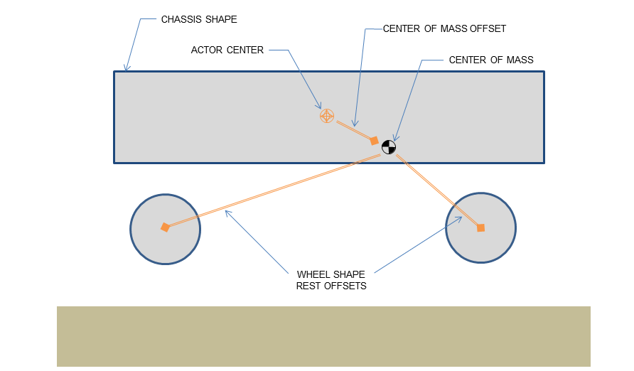
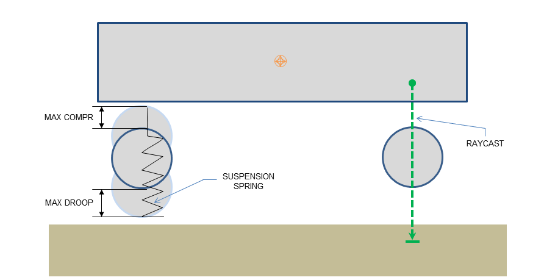

# Vehicle4WSimulator

Vehicle Simulation Operation

## 项目结构

| 文件                      | 内容                   |
| ------------------------- | ---------------------- |
| Particle.hpp              | 粒子数据结构           |
| ParticleForce.hpp         | 粒子受力生成器         |
| ParticleForceRegistry.hpp | 粒子受力注册           |
| Vehicle4WSimulator.hpp    | 车身和四个轮子受力模拟 |

## NVIDIA PhysX.Vehicle 模块

1. Spring model

NVIDIA PhysX 把 Vehicle 看成车身和轮子通过弹簧联系的模型，计算来自每个细长弹簧或压缩弹簧的悬架力，并将其添加到要施加到刚体上的总力上。

此外，悬架力用于计算承受在轮胎上的载荷。该载荷用于确定将在接触平面中生成的轮胎力，然后将其添加到要施加到刚体上的总力上。轮胎力的计算实际上取决于许多因素，包括转向角，外倾角，摩擦力，车轮转速和刚体动量，然后将所有轮胎力和悬架力的合计力施加到与车辆关联的刚体 actor。

<center>
    <div style="display:inline">
        
    </div>
    <br>
    <div style="color:orange; border-bottom: 1px solid #d9d9d9; display: inline-block; color: #999; padding: 2px;">
        iterator invalidation
    </div>
</center>

2. Raycast

通过 Raycast 获得车辆位置和碰撞信息，从轮胎最大压缩时的顶部上方开始，向下投射到最大下垂时轮胎底部下方的位置

<center>
    <div style="display:inline">
        
    </div>
    <br>
    <div style="color:orange; border-bottom: 1px solid #d9d9d9; display: inline-block; color: #999; padding: 2px;">
        iterator invalidation
    </div>
</center>

## 模拟流程

1. 把车身和四个轮子视作五个粒子，在运动过程中，分别受到以下的力，每一帧的合力影响下一帧的运动

2. 代码结构参考了*Game Physics Engine Development*书中随附物理引擎，把一个车身和四个轮胎看作五个粒子，用注册的方式为物体对应的力注册力发生器，每一帧根据注册信息更新

3. 代码实现参考了上述 PhysX.Vehicle 的模型，把车身和轮胎通过弹簧力联系实现

## 受力类型

1. 重力

车身和四个轮子均受到重力

```c++
class Gravity : public ForceGenerator {
    Vector3f gravity;

   public:
    Gravity(const Vector3f& gravity) : gravity(gravity) {}

    virtual void update_force(Particle* particle, float delta_time) {
        particle->update_force(particle->get_mass() * gravity);
    }
};
```

2. 弹簧力

车身和四个轮子均受到弹簧力，但 normal_length 即初始长度一正一负，表示受力时指向相反方向

```c++
class Spring : public ForceGenerator {
    Particle** other;
    int size;
    float spring_constant;
    float const* normal_length;

   public:
    Spring(Particle** other_,
           int size_,
           float spring_constant_,
           const float* normal_length_)
        : other(other_),
          size(size_),
          spring_constant(spring_constant_),
          normal_length(normal_length_) {}

    virtual void update_force(Particle* particle, float delta_time) {
        Vector3f force_sum;
        force_sum.setZero();

        for (int i = 0; i < size; i++) {
            float val =
                particle->get_location()(2) - other[i]->get_location()(2);
            val = val - normal_length[i];
            val *= spring_constant;
            Vector3f force = -val * normalized_Z;
            force_sum += force;
        }
        particle->update_force(force_sum);
    }
};
```

3. 摩擦力

四个轮子受到轨迹方向的摩擦力

```c++
class Friction : public ForceGenerator {
    float damping;
    float gravity_acc;

   public:
    Friction(float damping_, float gravity_acc_)
        : damping(damping_), gravity_acc(gravity_acc_) {}

    virtual void update_force(Particle* particle, float delta_time) {
        if (!particle->get_hit_point())
            return;

        float force = damping * particle->get_mass() * gravity_acc;
        for (int i = 0; i < 2; i++) {
            float vel_proj = particle->get_linear_velocity()(i);
            if (abs(vel_proj) < (force / particle->get_mass()) * delta_time) {
                particle->set_linear_velocity(i, 0.f);

            } else {
                force *= (vel_proj > 0 ? -1 : 1);
                particle->update_force(force * Vector3f((i + 1) % 2, i % 2, 0));
            }
        }
    }
};
```

4. 车身合力

即车身通过受力，在水平方向和轮子运动一致，通过直接设置速度达成这一约束

```c++
class FrameConstraint : public ForceGenerator {
    Particle** other;
    int size;

   public:
    FrameConstraint(Particle** other_, int size_)
        : other(other_), size(size_) {}

    virtual void update_force(Particle* particle, float delta_time) {
        for (int i = 0; i < 2; i++) {
            float vel_proj = 0.f;
            for (int j = 0; j < size; j++) {
                vel_proj += other[j]->get_linear_velocity()(i);
            }
            vel_proj /= size;
            particle->set_linear_velocity(i, vel_proj);
        }
    }
};
```

5. 支撑力

四个轮子受到支撑力稳定在地面

```c++
class Contact : public ForceGenerator {
    float balance;
    float loss_coeff;

   public:
    Contact(float balance_, float loss_coeff_)
        : balance(balance_), loss_coeff(loss_coeff_) {}

    virtual void update_force(Particle* particle, float delta_time) {
        Vector3f* hit_point = particle->get_hit_point();
        if (!hit_point)
            return;
        float force = 0.f;
        Vector3f linear_velocity = particle->get_linear_velocity();
        if (abs(linear_velocity(2)) < MAX_DEVIATION) {
            force = balance;
        } else {
            force = (1 + loss_coeff) * (-linear_velocity(2)) *
                        particle->get_mass() / delta_time +
                    balance;
        }
        particle->update_force(force * normalized_Z);
    }
};
```

## 操作模拟

1. 前后运动

增加/减少线性速度

```c++
void move(bool forward) {
    static char flag[2] = {-1, 1};
    linear_velocity(0) += flag[forward] * 20.f;
    linear_velocity(1) += flag[forward] * 20.f;
}
```

2. 左右转弯

增加/减少旋转角度

```c++
void turn(bool left, Vector3f torque, float delta_time, Matrix3f inertia) {
    static char flag[2] = {-1, 1};
    angular_velocity += delta_time * inertia.inverse() * torque;

    float angular_vel_norm, angular_delta_angle;
    angular_vel_norm = angular_delta_angle = 0.f;
    Vector3f angular_vel_axis;
    angular_vel_axis.setZero();
    if (!angular_velocity.isZero()) {
        angular_vel_norm = angular_velocity.norm();
        angular_delta_angle = angular_vel_norm * delta_time;
        angular_vel_axis = angular_velocity / angular_vel_norm;
    }

    Quaternionf delta_quat;
    set_quat(angular_delta_angle, angular_vel_axis, &delta_quat);
    quat = delta_quat * quat;
}
```

3. ue4 中设置键盘映射，通过按键调用上述函数，从而在 ue4 中操作
